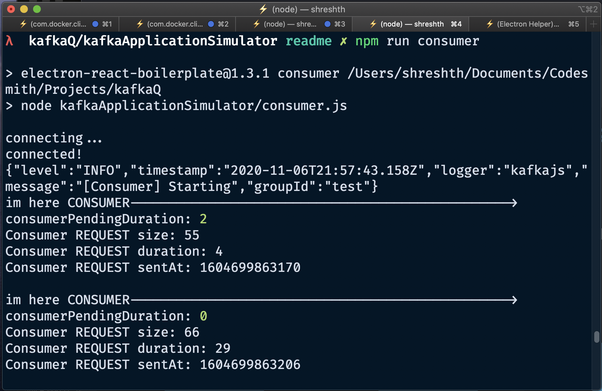

# kafkaQ


<p align="center">
  
  
  
  
    
</p>

## Table of Contents

[Overview](#overview)  
[Demo](#demo)  
[Documentation](#documentation)  
[Quick Start](#quick-start)  
[Viewing your metrics](#viewing-your-metrics)  
[See kafkaQ in action using our Kafka application simulator](#see-kafkaq-in-action-using-our-kafka-application-simulator)

## Overview

- Monitor your Kafka application in real-time to diagnose vulnerabilities and improve system health
- Track key metrics like data size, processing time, and pending duration for producers and consumers
- Integrate kafkaQ with your application in a matter of minutes
- Compatible with the KafkaJS API for Node.js backends

kafkaQ is a central location where you can find important data about your Kafka application's performance. Our dashboard provides critical insight about your system's activity, allowing rapid diagnosis of vulnerabilities.

Informed by our statistics, you can determine the optimal approach to scale your Kafka architecture, whether it means adding more brokers or reconfiguring your zookeeper.

## Demo

Put some screenshots or gifs here

## Documentation

Link to our companion website

## Quick Start

kafkaQ is incredibly easy to incorporate into your application. Let's walk through the steps you'll need to take.

1. In your project's root directory, run `npm install kafkaq-monitor`
2. In the producer script of your Kafka application, import our `trackProducer` method and invoke it immediately after the code connecting your producer, passing in your producer as an argument. Here's an example:

```javascript
const { Kafka } = require('kafkajs');
const { trackProducer } = require('kafkaq-monitor'); // kafkaQ's NPM package

const kafka = new Kafka({
  clientId: 'myapp',
  brokers: [`${process.env.LOCAL_COMPUTER}:9092`],
});

const producer = kafka.producer();
await producer.connect();

trackProducer(producer); // Invoke kafkaQ's trackProducer method with your producer as the argument

const result = await producer.send({
  topic: 'Users',
  messages: [
    {
      value: 'test',
      partition: 0,
    },
  ],
});

await producer.disconnect();
```

3. We will now connect kafkaQ to your consumer. This will be very similar to the previous step. Import our `trackConsumer` method and invoke it after your consumer subscribes to a topic, passing your consumer as the argument. Here's an example:

```javascript
const { Kafka } = require('kafkajs');
const { trackConsumer } = require('kafkaq-monitor'); // kafkaQ's NPM package

const kafka = new Kafka({
  clientId: 'myapp',
  brokers: [`${process.env.LOCAL_COMPUTER}:9092`],
});
const consumer = kafka.consumer({
  groupId: 'test',
});

await consumer.connect();

await consumer.subscribe({
  topic: 'Users',
  fromBeginning: true,
});

trackConsumer(consumer); // Invoke kafkaQ's trackConsumer method with your consumer as the argument

await consumer.run({
  eachMessage: async (result) => {
    // Execute some code for each message
  },
});
```

You're done! In just 4 lines of code, you were able to integrate kafkaQ with your application for real-time tracking. In the next section, we'll see how to view your metrics.

## Viewing your metrics

To view your metrics, you will need to use the Electron app built in this repo. Follow these instructions.

1. Clone this repo (`git clone https://github.com/oslabs-beta/kafkaQ.git`) and cd into it (`cd kafkaq`).
2. Start the application with `npm run electron-app`. This allows kafkaQ to send its metrics to our Electron UI.

You're all set! You should be able to track analytics as data moves through your Kafka application, and make vital decisions about scaling your distributed system.

## See kafkaQ in action using our Kafka application simulator

If you haven't yet set up your Kafka application, but you want to see how kafkaQ works, we've got you covered. In this section, we'll show you how to set up our Kafka application simulator and track its metrics using kafkaQ.

First, clone this repo (`git clone https://github.com/oslabs-beta/kafkaQ.git`) and cd into it (`cd kafkaq`). From here, we will split the instructions into 3 sections for clarity.

## Section I: Starting Kafka

We will be using Docker images to start Kafka, so make sure to install Docker and create an account.

1. Start by ensuring that Docker is running with `docker run hello-world`. If Docker is not running, you should open the Docker desktop app; otherwise, you should see something similar to this:


2. Now, we will start a Kafka zookeeper instance. Run this command to start a zookeeper instance and expose it on port 2181: `docker run --name zookeeper -p 2181:2181 zookeeper`

3. For our next step, you will need to copy your computer's reference on your local network. On a Mac, you can find this by going to Systems Preferences > Sharing. Under the section "Computer Name", you should be able to find it. See the example below:


4. Now that you have your local computer's reference, you're ready to start Kafka. Make sure to replace [LOCAL_COMPUTER] with this reference (note that you should NOT include the square brackets). Run the following command: `docker run --name kafka -p 9092:9092 -e KAFKA_ZOOKEEPER_CONNECT=[LOCAL_COMPUTER]:2181 -e KAFKA_ADVERTISED_LISTENERS=PLAINTEXT://[LOCAL_COMPUTER]:9092 -e KAFKA_OFFSETS_TOPIC_REPLICATION_FACTOR=1 confluentinc/cp-kafka`

This is all you need to do to start Kafka! Make sure to save your local computer's reference as we will use that in future sections.

### Section II: Set up the Kafka application simulator

Before we get started with this section, you will need to create a file called `.env` and have it mimic this example:


1. Cd into the kafkaApplicationSimulator directory (`cd kafkaApplicationSimulator`)
2. Start the server for our Kafka application simulator using `npm run simulator-server`. This server has a route that will connect a producer and send a message, which we will use later.
3. Run `npm run electron-app` to start our server (our producer and consumer will need to connect to this) and open the Electron app.
4. Start your Kafka consumer with `npm run consumer`. You should see output similar to this:



4. Finally, we'll need to send some data through our system. To do so, run our Go script using `npm run go-script`. Note that if you have not installed Go, you will need to run `brew install golang` before completing this step. For future reference, if you would like to increase or decrease the volume of data sent through your system, simply change the NUM_STRINGS variable in kafkaApplicationSimulator/generate_data.go

## Authors

kafkaQ Engineers

[Jonathan Barenboim](https://github.com/Jbaren01)  
[Kaiwei Hsu](https://github.com/kaiweih)  
[Micah Turan](https://github.com/ymturan)  
[Shreshth Srivastava](https://github.com/Shreshth3)
